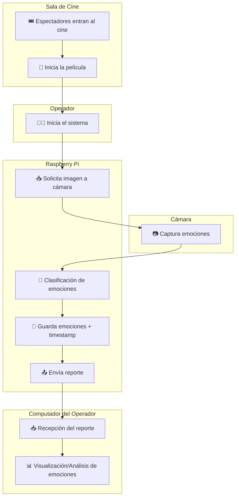
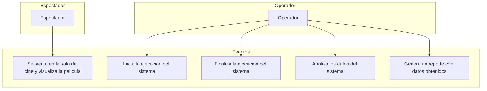
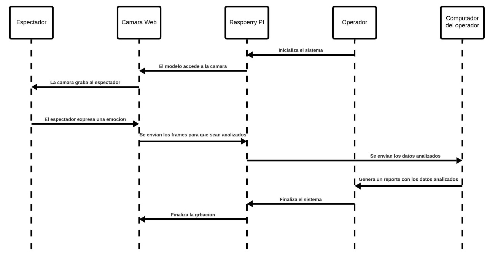
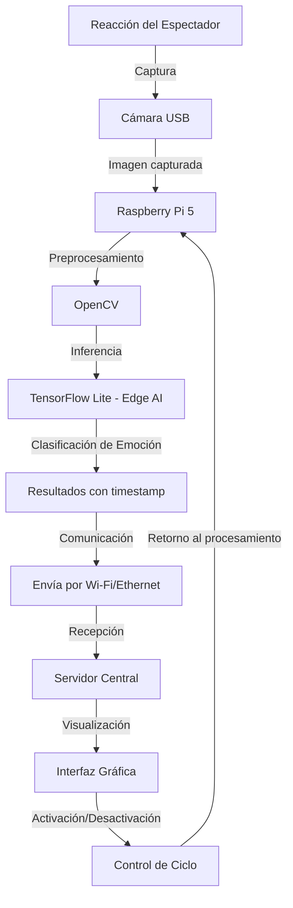
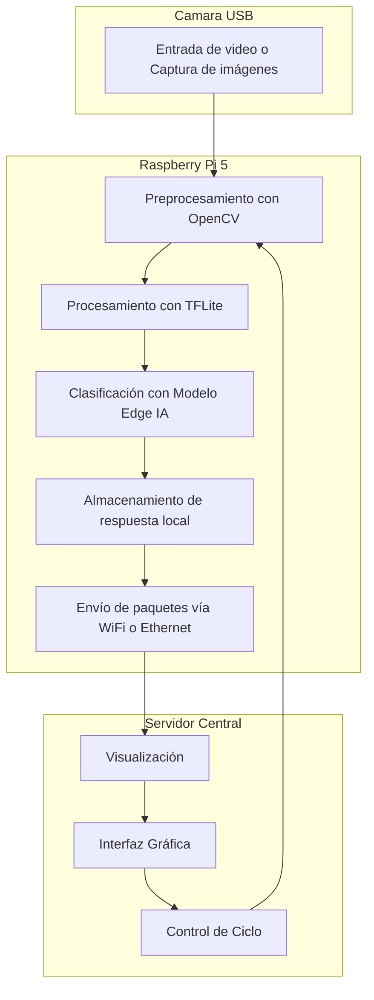
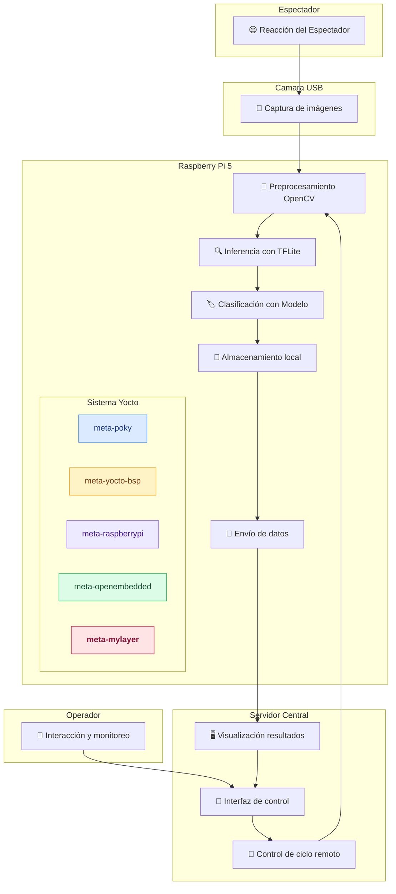

# Justificación

El proyecto propuesto tiene un gran potencial para mejorar la experiencia del espectador en las salas de cine. La aplicación permitiría recopilar datos sobre las reacciones emocionales de los espectadores ante diferentes tipos de escenas, lo que facilitaría el entrenamiento de nuevos modelos de aprendizaje automático más precisos y eficientes. Eso sería posible mediante esta adaptabilidad, ya que ayudaría a ofrecer recomendaciones personalizadas, como propuestas de película o cambio de género, basadas en el estado emocional del espectador. Es decir, si el sistema detectara señales de aburrimiento o desinterés, podría proponer una alternativa más próxima a sus gustos, con lo que su nivel de satisfacción aumentaría [5].

Desde una perspectiva social, este proyecto tiene implicaciones significativas en términos de inclusión, bienestar y accesibilidad. La capacidad de detectar emociones en tiempo real puede utilizarse para crear entornos más empáticos y receptivos, especialmente en contextos donde la expresión emocional puede estar limitada o inhibida [6]. Por ejemplo, personas con condiciones que dificulten la comunicación verbal podrían beneficiarse de sistemas que interpreten su estado emocional y ajusten la interacción del entorno en consecuencia [7].

Desde el punto de vista técnico el principal reto consiste en integrar diversos componentes tecnológicos en un sistema compacto y eficiente de una Raspberry Pi. Esta se encargará de ejecutar las herramientas de visión por computadora con la ayuda de OpenCV, para procesar las imágenes en tiempo real. Además, se implementará un modelo de redes neuronales optimizado para dispositivos embebidos mediante TensorFlow Lite, lo que permite realizar el procesamiento local sin comprometer el rendimiento [8].

El sistema debe ser capaz de reconocer seis emociones básicas: ira, alegría, tristeza, miedo, asco y sorpresa. Se logra entrenar al realizarlo en redes neuronales profundas en bases de datos de imágenes faciales con gran volumen y etiquetadas. Para garantizar un procesamiento eficiente en dispositivos de bajo consumo, el modelo de red neuronal será optimizado o recortado para ejecutarse en dispositivos como la Raspberry Pi [9] que en muchos casos conlleva a consecuencias como la reducción la precisión o certeza del modelo.

Por otro lado, como norma se debe asegurar que el sistema cuente con mecanismos de seguridad y privacidad que garanticen que los datos capturados sean procesados de manera segura. Esto implica el uso de técnicas de encriptación para transmitir la información de manera protegida hacia un sistema de análisis local [10]. Además, la personalización del sistema operativo a través del uso de Yocto Project facilitará la creación de una imagen de sistema operativo optimizada y específica para el hardware de la Raspberry Pi 5, garantizando que todas las dependencias necesarias para el correcto funcionamiento del sistema [11].

La integración de sistemas de reconocimiento emocional en entornos como las salas de cine es un avance significativo en el campo de la interacción humano-máquina (HCI). Estos sistemas permiten adaptar dinámicamente la experiencia del usuario en función de su estado emocional, lo que favorece una comunicación más natural y empática entre el ser humano y la tecnología. En el contexto del entretenimiento, esto podría traducirse en una mayor inmersión y disfrute, ya que el contenido se ajusta automáticamente a las respuestas emocionales del espectador. Este enfoque se alinea con los postulados del affective computing, un área de la HCI que pretende endosar a los sistemas computacionales el algoritmo para reconocer, interpretar y responder a emociones humanas, y que por lo tanto mejora la calidad de interacción y la satisfacción del usuario [12].

Al considerar la utilización de tecnologías que monitorean emociones, se alude a beneficios potenciales por lo que respecta a la personalización y al bienestar, pero también se levantaron cuestiones al respecto de su impacto psicológico. La continua evaluación emocional puede tener efectos secundarios, como fatiga cognitiva, sensación de vigilancia o dependencia de validaciones externas por parte del sistema. Por otro lado, también se corre el riesgo de que los usuarios cambien su comportamiento de manera inconsciente al sentirse observados, lo que podría alterar la autenticidad de sus reacciones. Es necesario tener en cuenta estos factores para diseñar sistemas que no solo sean eficientes a nivel tecnológico, sino también emocionalmente sostenibles. Por lo tanto, corresponde el establecimiento de mecanismos de control, consentimiento informado y retroalimentación del usuario que fomenten una relación ética y saludable con estas tecnologías [13].

Por último este proyecto tiene futuro en el análisis emocional en salas de cine, que puede tener la capacidad de analizar emociones en tiempo real de espectadores y tener una personalización del contenido. Por último, el sistema es potencial para ser utilizado a otros campos de aplicación, tales como la educación o el bienestar mental, donde el seguimiento emocional tiene una influencia benefactora para el bienestar de las personas [14].

---

# Problema
En la actualidad, el análisis automático de emociones ha ganado relevancia en sectores como la publicidad, la salud mental, la educación y el entretenimiento. Particularmente en la industria del cine, comprender las reacciones emocionales de los espectadores ante determinados estímulos visuales puede aportar información valiosa para el desarrollo de contenido más atractivo y personalizado [1]. No obstante, los métodos tradicionales de recolección de estas emociones (encuestas post-función, entrevistas, etc.) resultan ser poco precisos, no escalables y altamente dependientes de la memoria y predisposición del espectador. Esta limitación impide una evaluación en tiempo real y en condiciones naturales, donde las emociones espontáneas son clave [2].

Para solventar esta situación, se requiere el desarrollo de un sistema embebido que, de manera autónoma y en tiempo real, capture y clasifique las expresiones faciales de los espectadores durante la proyección de una película. Este sistema deberá operar bajo un esquema de edge computing (Edge AI), procesando localmente la información capturada para minimizar la latencia y proteger la privacidad del usuario. El reto técnico incluye integrar hardware compacto (Raspberry Pi), herramientas de visión por computador (OpenCV), modelo de redes neuronales optimizadas para dispositivos embebidos (TensorFlow Lite) y una imagen de sistema operativo personalizada generada con Yocto Project, que contemple todas las dependencias y configuraciones necesarias para la operación [3].

El sistema debe reconocer al menos seis emociones básicas: enojo, felicidad, tristeza, miedo, disgusto y sorpresa. También debe registrar la actividad detectada mediante estampas de tiempo y transmitir los datos de forma segura hacia un sistema remoto o local para su posterior análisis [4]. Todo este procesamiento debe llevarse a cabo localmente para minimizar la latencia y optimizar el uso del ancho de banda.

Este proyecto representa un caso de estudio realista y desafiante en el diseño de soluciones inteligentes, distribuidas y embebidas, con aplicación directa en contextos del mundo real como las salas de cine, y potencial de escalabilidad hacia otros entornos sensibles al análisis emocional.

---

# Requerimientos

Entre los Requerimientos funcionales del sistema a implementar, se debe cumplir con lo siguiente:

## ✅ 1. Requerimientos Funcionales (RF)
| ID  | Nombre                        | Descripción                                                                                     |
| --- | ----------------------------- | ----------------------------------------------------------------------------------------------- |
| RF1 | Captura de imágenes           | El sistema debe capturar imágenes de los rostros de los espectadores utilizando una cámara USB. |
| RF2 | Clasificación de emociones    | El sistema debe clasificar emociones en enojo, disgusto, miedo, felicidad, tristeza y sorpresa. |
| RF3 | Procesamiento local (Edge AI) | El procesamiento de imágenes y clasificación debe realizarse localmente en la Raspberry Pi 5.   |
| RF4 | Almacenamiento de resultados  | El sistema debe almacenar los resultados de la clasificación por nodo con marca temporal.       |
| RF5 | Comunicación en red           | Los nodos deben enviar sus resultados a un servidor central de manera periódica.                |
| RF6 | No intrusión al ambiente      | El sistema no debe perturbar la experiencia de los espectadores ni ser visualmente evidente.    |
| RF7 | Visualización remota         | El sistema debe permitir la visualización de los resultados de emociones desde una interfaz en un servidor o PC. |


## ✅ 2. Requerimientos No Funcionales (RNF)
Es importante aclarar que los **Requerimientos No Funcionales** hacen referencias a **restricciones o características de calidad que debe cumplir el sistema**, siendo "una métrica" para evaluar el rendimiento del sistema empleado. 
| ID   | Nombre                     | Descripción                                                                 |
| ---- | -------------------------- | --------------------------------------------------------------------------- |
| RNF1 | Tiempo de respuesta        | El sistema debe clasificar emociones en menos de 2 segundos por imagen.     |
| RNF2 | Precisión del modelo       | El modelo de emociones debe tener al menos 80% de precisión en validación.  |
| RNF3 | Uso de recursos limitado   | El sistema debe funcionar con un máximo del 70% de CPU y 512 MB de RAM.     |
| RNF4 | Portabilidad               | El sistema debe ser desplegable en Raspberry Pi 5.                          |
| RNF5 | Privacidad de los usuarios | No se debe almacenar imágenes completas ni datos personales identificables. |
| RNF6 | Requerimientos de energía   | Cada nodo debe poder alimentarse con una fuente de 5V 3A mediante USB-C. |


## ✅ 3. Requerimientos del Sistema (Hardware y Software)
Entre lo planeado para el hardware a utilizar se proponen los siguientes elementos:

| Tipo          | Requerimiento                                                                                                                                                                                         |
| ------------- | ----------------------------------------------------------------------------------------------------------------------------------------------------------------------------------------------------- |
| **Hardware**  | - Raspberry Pi 5 (8GB RAM)  <br> - Webcam USB tipo UVC  <br> - Fuente de alimentación 5V 3A USB-C <br> - Conectividad Wi-Fi o Ethernet                                       |
| **Software**  | - Linux embebido generado con **Yocto Project** <br> - Python 3.10+ <br> - OpenCV 4+ <br> - TensorFlow Lite (tflite-runtime) <br> - Sistema de comunicación cliente-servidor para envío de resultados |
| **Bibliotecas** | - Numpy <br> - OpenCV <br> - TensorFlow Lite Runtime <br> - imutils <br> - PyUSB                                                                          |
| **Dataset**   | - Bases de datos de emociones faciales etiquetadas como:  <br> → FER2013  <br> → RAF-DB  <br> → CK+ (Cohn-Kanade+)                                                                                    |


---

# Vista Operacional
A continuación, se muestra un diagrama de la vista operacional del sistema:



## 🧩 Descripción de la vista operacional
En este punto se presenta una descripción del comportamiento del sistema con el fin de que cualquier persona pueda entender su funcionamiento. Es importante que el modelo defina una perspectiva completamente operacional, sencilla y comprensible para el usuario. Por esta razón, se realiza una representación de alto nivel, en la cual se destacan los componentes principales del sistema y la manera en que se utilizan de forma secuencial para lograr la detección y registro de emociones. Esta representación permite visualizar el flujo de operación desde la llegada del espectador hasta la recopilación final de datos por parte del operador.

- 🎟️ Llegada del público: Los espectadores ingresan a la sala de cine y se acomodan en sus respectivas butacas para disfrutar de la película.

- 🧑‍💻 Operador: Cuando inicia la película, el operador activa el sistema de detección de emociones. Para ello, envía un comando a la Raspberry Pi a través de la red WiFi, ordenándole que encienda la cámara y comience el procesamiento.

- 🟦 Cámara USB: La camára se conecta a la Raspberry Pi, esta comienza a capturar imágenes de los rostros del público a razón de 1 fotograma por segundo (1 fps), y envía las capturas en tiempo real a la Pi.

- 🟩 Raspberry Pi 5: La raspberry recibe las imágenes capturadas por la cámara y la clasifica para determinar el estado emocional de la persona, por ultimo guarda la imagen mediante un archivo que contiene la emoción y el tiempo en que el rostro fue capturado.

- 🟥 Computador del Operador: Cuando termina la función o el operador decide finalizar el monitoreo, este envía otro comando a la Raspberry Pi para detener el sistema. Los archivos generados (emociones + timestamps) se transfieren automáticamente al computador del operador mediante protocolo SSH, aprovechando que ambos dispositivos están conectados a la misma red WiFi.

## 🎯 Diagrama de casos de uso
A partir de las funciones que desempeñan el espectador y el operador, es posible construir el diagrama de casos de uso. El espectador simplemente se sienta y disfruta de la función de cine, mientras que el operador se encarga de varias funciones importantes como iniciar y finalizar la ejecución de la aplicación, además de analizar los datos obtenidos y generar reportes.

Cabe destacar que la elección de capturar las imágenes a una tasa de 1 cuadro por segundo (1 fps) se debe a que las emociones de corta duración —que suelen ser las expresiones más comunes al visualizar una película— tienden a mantenerse durante varios segundos. Por ello, este intervalo de captura resulta suficiente para registrar dichas emociones de manera efectiva [15].



## 🕒 Diagrama de secuencia
Seguidamente se presenta el diagrama de secuencia del sistema, en el que se consideran cinco elementos principales: el espectador, la cámara, la Raspberry Pi, el operador y el computador del operador. En esta secuencia, el espectador se limita a disfrutar de la película sin intervenir en el proceso. El operador se encarga de inicializar el sistema, lo que activa la interfaz e inicia el programa de detección de emociones. A partir de este punto, la cámara captura imágenes que son procesadas por la Raspberry Pi, donde también se almacenan los archivos generados. Este ciclo se repite de forma continua hasta que el operador decide finalizar la ejecución. Finalmente, los datos son transferidos al computador, donde la interfaz permite visualizar los resultados en formato de texto o gráficos.

<p align="center">
  
</p>


---

# Vista Funcional
En esta apartado se analizará la interacción de los componentes del sistema y sus funciones clave.

## 1. Entrada: Captura de Datos
- **Función**: Capturar imágenes faciales de los espectadores.

- **Dispositivo**: Cámara USB conectada a la Raspberry Pi.

- **Descripción**: La cámara, instalada discretamente en los respaldos de los asientos, toma imágenes de los rostros en tiempo real, sin invadir la privacidad ni distraer al espectador.

## 2. Preprocesamiento de Imágenes
- **Función**: Preparar las imágenes para la clasificación.

- **Software**: OpenCV.

- **Descripción**: Se aplican transformaciones como redimensionamiento, normalización y conversión a escala de grises. Esto optimiza el rendimiento del modelo y reduce la carga de procesamiento.


## 3. Clasificación de Emociones
- **Función**: Detectar la emoción del espectador en cada imagen capturada.

- **Modelo**: Modelo ligero de aprendizaje profundo entrenado con bases como FER2013, RAF-DB o CK+.

- **Emociones clasificadas**: Enojo, disgusto, miedo, felicidad, tristeza y sorpresa.

- **Descripción**: El modelo, ejecutado localmente mediante TensorFlow Lite, clasifica emociones en menos de 2 segundos por imagen, utilizando la capacidad de procesamiento de la Raspberry Pi (Edge AI), sin depender de la nube.

## 4. Almacenamiento y Registro Local
- **Función**: Guardar temporalmente los resultados de la clasificación con marca de tiempo.

- **Dispositivo**: Almacenamiento local en la Raspberry Pi.

- **Descripción**: Los datos se almacenan como archivos estructurados o en una base de datos ligera para su posterior consulta y respaldo.

## 5. Envío de Resultados al Servidor
- **Función**: Transmitir los resultados periódicamente a un servidor central o computador central.

- **Protocolo**: HTTP, MQTT o WebSocket.

- **Descripción**: Los datos son enviados por red local (Wi-Fi o Ethernet). Idealmente la transmisión debería ser eficiente y no interferir con el desempeño del sistema embebido.

## 6. Visualización e Interacción
- **Función**: Mostrar los resultados en una interfaz gráfica accesible para el operador.

- **Software**: Interfaz local personalizada.

- **Descripción**: Los datos se presentan de forma visual, permitiendo un análisis en tiempo real o histórico del comportamiento emocional del público. Se puede incluir una función de activación/desactivación del sistema.

---

# Diagrama de Flujo de Reconocimiento y clasificacion de emociones



## 📘 Descripción funcional del flujo del sistema
El sistema comienza con la Cámara USB, que se encarga de la captura de imágenes o video en tiempo real. Estas imágenes se envían directamente a la Raspberry Pi 5, que actúa como el núcleo de procesamiento local.

En la Raspberry Pi, las imágenes pasan primero por una etapa de preprocesamiento utilizando OpenCV, donde se realizan operaciones como redimensionamiento, conversión a escala de grises y limpieza de ruido para optimizar el análisis posterior. A continuación, las imágenes preprocesadas son procesadas mediante TensorFlow Lite, lo que permite ejecutar modelos de inteligencia artificial livianos directamente en el dispositivo.

Posteriormente, el sistema realiza la clasificación emocional utilizando un modelo de Edge AI, que detecta emociones como felicidad, tristeza, enojo, entre otras. Los resultados de esta inferencia se almacenan localmente junto con una marca temporal para futuras referencias o auditoría.

Luego, los datos son empaquetados y enviados vía Wi-Fi o Ethernet al Servidor Central, donde se realiza la visualización de los resultados. La información es desplegada en una interfaz gráfica amigable, permitiendo a los operadores monitorear en tiempo real o analizar datos históricos.

Finalmente, desde esta interfaz también se puede ejercer un control del ciclo del sistema, que puede ajustar parámetros o reiniciar el proceso. Esta orden de control se retroalimenta a la Raspberry Pi, reiniciando el flujo de procesamiento a partir del preprocesamiento.


---

# Arquitectura
La arquitectura del sistema combinará componentes de hardware y software para capturar, procesar, clasificar y visualizar las emociones de los espectadores en tiempo real. A continuación, se describe cómo cada función del sistema es ejecutada por un conjunto específico de componentes.

## Descripción General
El sistema está compuesto por los siguientes bloques funcionales:

### 1. Captura de Imágenes

- **Función**: Obtener imágenes faciales del espectador.

- **Hardware**: Cámara USB tipo UVC.

- **Interfaz**: USB.

### 2. Procesamiento y Clasificación de Emociones (Edge AI)

- **Función**: Preprocesar imágenes y detectar emociones.

- **Hardware**: Raspberry Pi 5.

- **Software**: OpenCV (preprocesamiento), TensorFlow Lite (procesamiento), Modelo (Edge AI).

- **Interfaz**: Interna (entre módulos de software en la Raspberry Pi).

### 3. Almacenamiento Temporal

- **Función**: Registrar resultados con marca de tiempo.

- **Hardware**: Memoria local (SD de almacenamiento interno de la Raspberry Pi).

- **Software**: Python (manejo de archivos).


### 4. Comunicación y Transmisión de Resultados

- **Función**: Enviar datos al servidor central.

- **Hardware**: Módulo de red de la Raspberry Pi (Wi-Fi o Ethernet).

- **Software**: Cliente HTTP, MQTT o WebSocket implementado en Python.

### 5. Visualización de Datos

- **Función**: Mostrar los resultados de forma gráfica para su análisis.

- **Hardware**: Servidor central (PC o nube).

- **Software**: Dashboard en Grafana, Kibana o una aplicación web.

## Diagrama de Arquitectura del Sistema


## 📘 Descripción funcional del flujo del sistema
El sistema inicia con una cámara USB que captura imágenes en tiempo real, para luego ser enviadas a una Raspberry Pi 5, donde se preprocesan con OpenCV y luego se analizan usando TensorFlow Lite con un modelo de edge IA embebida para reconocimiento emocional. Las emociones detectadas (felicidad, tristeza, enojo, etc.) se guardan con marca temporal y se transmiten por Wi-Fi o Ethernet a un servidor o computador central, donde se visualizan en una interfaz gráfica. Esta interfaz permite el monitoreo en tiempo real.


---

# Dependencias
Dentro de las dependencias generales para la imagen del sistema operativo de Yocto.

## 🌲 Árbol de Dependencias de Capas Yocto (general)
```plaintext
poky
│
├── meta-poky (distribución de referencia)
├── meta-yocto-bsp (BSPs de referencia)
├── meta-openembedded
│   ├── meta-oe (paquetes básicos y utilidades)
│   ├── meta-python (soporte para Python y paquetes relacionados)
│   ├── meta-multimedia (paquetes multimedia: codecs, players, etc.)
│   └── meta-networking (paquetes de red y protocolos)
│
├── meta-raspberrypi (BSP específico para RPi)
└── meta-mylayer (capa personalizada del usuario para la app DNN)

```

## 📋 Análisis general de las dependencias:
`meta y meta-poky`: proporcionan el núcleo del sistema de construcción (Poky) y la distribución base de referencia.

`meta-yocto-bsp`: incluye soporte para placas de hardware de referencia para la Raspberry Pi.

`meta-openembedded`: agrupación clave que extiende las capacidades de Poky.

`meta-oe`: utilidades básicas, bibliotecas comunes.

`meta-python`: dependencias de Python.

`meta-multimedia`: soporte para procesamiento de video/audio.

`meta-networking`: gestión de interfaces y protocolos de red.

`meta-raspberrypi`: contiene todo lo necesario para generar imágenes compatibles con Raspberry Pi.

`meta-mylayer`: es la capa personalizada que incluye recetas para la aplicación de inferencia, los scripts y las dependencias específicas.


---

# Integración

El diagrama de la arquitectura integrada de software y hardware es: 




## 🧩 Descripción del proceso de integración hardware/software
La solución implementada combina de forma coordinada componentes de hardware y software para lograr un sistema funcional de detección y visualización de emociones. A continuación se detalla cómo se integran y complementan estos componentes en cada etapa del proceso:

- 😃 Reacción del Espectador: Es la reacción o la expresión de la emoción por parte del espectador

- 🟦 Cámara USB (hardware): Es el punto de entrada del sistema. Captura imágenes en tiempo real del espectador o usuario cuya expresión emocional será analizada.

- 🟩 Raspberry Pi 5 (hardware + software): Actúa como nodo de procesamiento en el borde. Recibe la imagen desde la cámara y ejecuta varios procesos:

  - OpenCV (software): Realiza el preprocesamiento de la imagen (detección de rostro, recorte, escalado y normalización).

  - TensorFlow Lite (software): Ejecuta el modelo de aprendizaje automático entrenado para clasificar emociones en tiempo real.

  - Red de comunicación (hardware/software): Se utiliza WiFi o Ethernet para transferir los resultados inferidos (emociones y timestamps) al servidor central.

- 🟥 Servidor o computador Central (hardware + software): Recibe los datos procesados desde la Raspberry Pi y permite la interacción con el operador:

  - Interfaz Gráfica (software): Presenta visualmente las emociones detectadas y permite al operador ajustar parámetros del sistema (por ejemplo, encender/apagar el ciclo de inferencia o cambiar umbrales de confianza).

  - Control remoto del ciclo de procesamiento (software): El operador puede modificar el comportamiento del sistema en tiempo real, enviando instrucciones de vuelta a la Raspberry Pi.

Este diseño modular e integrado permite una interacción fluida entre hardware y software: la Raspberry Pi se encarga de la inferencia local, optimizando la latencia y reduciendo la carga sobre la red, mientras que el servidor central actúa como centro de control y visualización, facilitando ajustes remotos y monitoreo continuo.


---

# Planificación
Para garantizar una ejecución ordenada y efectiva del proyecto, se realizó una planificación estructurada que contempla la asignación de roles, la división de tareas y la definición de entregables asociados a cada fase del desarrollo. Esta planificación está representada en un diagrama de Gantt, el cual permite visualizar la secuencia lógica y temporal de las actividades. A continuación, se presenta la lista de tareas principales que guiarán el desarrollo del sistema embebido:

- Revisión técnica y conceptual del problema: Esta etapa inicial está orientada a comprender en profundidad los objetivos del proyecto, las emociones a clasificar, y los requisitos funcionales y no funcionales del sistema. Incluye además el estudio preliminar de las tecnologías involucradas.
- Diseño y documentación de la propuesta técnica: Se elabora el documento de propuesta de diseño, el cual define la arquitectura general del sistema, los componentes a integrar, y los criterios de operación bajo un esquema de Edge AI.
- Desarrollo inicial del modelo de clasificación de emociones: Se implementa un modelo de reconocimiento facial de emociones en Python, utilizando un entorno de escritorio como plataforma de prueba. Esta versión permitirá validar la lógica del modelo y realizar ajustes antes de optimizarlo.
- Incorporación de funcionalidad de registro: Se añade al sistema la capacidad de registrar los resultados de la clasificación junto con sus respectivas marcas de tiempo, en un formato estructurado para facilitar su análisis posterior.
- Conversión y validación del modelo con TensorFlow Lite: El modelo desarrollado se convierte a TensorFlow Lite para reducir su tamaño y mejorar su rendimiento en entornos con recursos limitados. Posteriormente se realizan pruebas de compatibilidad y precisión.
- Configuración de capas Yocto necesarias para el sistema: Se configuran e integran las capas meta-tensorflow-lite, meta-openembedded, meta-python y meta-raspberrypi, necesarias para compilar una imagen personalizada de Linux compatible con Raspberry Pi y con las dependencias requeridas.
- Desarrollo de capa personalizada meta-edgeAI: Se crea una capa específica que contenga tanto el modelo convertido como el código necesario para ejecutarlo dentro del sistema embebido.
- Generación y prueba de la imagen embebida en entorno virtual: Se genera la imagen del sistema operativo mediante Yocto y se prueba en un entorno de máquina virtual utilizando videos como insumo para simular la entrada de cámara.
- Despliegue y verificación en hardware físico: La imagen generada se despliega en una Raspberry Pi 4, conectada a una cámara. Se valida el funcionamiento del sistema en condiciones reales, verificando detección, registro y procesamiento local.
- Implementación de la comunicación remota: Se establece un canal de comunicación seguro entre la Raspberry Pi y un equipo remoto utilizando SSH, permitiendo la transferencia de reportes y el control del sistema de forma externa.
- Desarrollo de una interfaz operativa básica: Se crea una interfaz de usuario simple que facilite el arranque, monitoreo y cierre del sistema, así como la consulta de los reportes generados.
- Integración final y pruebas completas del sistema: Se realiza una verificación integral que incluya detección en tiempo real, registro local, comunicación remota, y funcionamiento continuo en la Raspberry Pi, asegurando la coherencia con los objetivos del proyecto.

## Diagrama de Gantt
<p align="center">
  
</p>


---

# Conclusiones
El desarrollo de un sistema embebido para el reconocimiento y clasificación de expresiones faciales en una sala de cine es una solución innovadora basada en tecnologías de Edge AI para el análisis emocional en tiempo real. El proyecto integra de forma efectiva hardware y software especializados, incluyendo plataformas como Raspberry Pi, herramientas de visión por computador como OpenCV, modelos optimizados con TensorFlow Lite y entornos de construcción personalizados como Yocto Project. La capacidad del sistema para identificar emociones como enojo, felicidad, tristeza y sorpresa evidencia su aplicabilidad en entornos interactivos, destacando su potencial en sectores como el entretenimiento, la experiencia del usuario y el análisis de comportamiento humano.
Además, el trabajo destaca la importancia de una metodología de desarrollo estructurada, con una gestión adecuada de requerimientos, una clara definición de roles dentro del equipo, y un análisis detallado de dependencias para la integración eficiente de hardware y software. La implementación práctica evidencia la viabilidad técnica del sistema, así como su capacidad para ofrecer soluciones funcionales y confiables en escenarios del mundo real. Este proyecto refuerza el valor de la planificación colaborativa y la innovación tecnológica en el ámbito de los sistemas embebidos.


---

# Referencias

[1] T. -L. Liao, Y. -Y. Hou and Y. -H. Tseng, "Movie Recommendation System Based on Facial Emotion Recognition," 2024 IEEE International Conference on Future Machine Learning and Data Science (FMLDS), Sydney, Australia, 2024, pp. 141-146, doi: 10.1109/FMLDS63805.2024.00036.

[2] D. Shukla, R. Kumari and A. Bhargavi, "Human Face Detection and Emotion Recognition Using OpenCV through AI," 2024 12th International Conference on Internet of Everything, Microwave, Embedded, Communication and Networks (IEMECON), Jaipur, India, 2024, pp. 1-5, doi: 10.1109/IEMECON62401.2024.10845980.

[3] S. Turabzadeh, H. Meng, R. M. Swash, M. Pleva and J. Juhar, "Real-time emotional state detection from facial expression on embedded devices," 2017 Seventh International Conference on Innovative Computing Technology (INTECH), Luton, UK, 2017, pp. 46-51, doi: 10.1109/INTECH.2017.8102423.

[4] M. Srinivas; Sanjeev Saurav; Akshay Nayak; A. P. Murukessan, "Facial Expression Recognition Using Fusion of Deep Learning and Multiple Features," in Machine Learning Algorithms and Applications , Wiley, 2021, pp.229-246, doi: 10.1002/9781119769262.ch13.

[5] Matsumoto, D., Hwang, H. S., López, R. M., & Pérez-Nieto, M. Á. (2013). Lectura de la expresión facial de las emociones: Investigación básica en la mejora del reconocimiento de emociones. Ansiedad y estrés.

[6] Lee, J. R. H., & Wong, A. (2020). AEGIS: A real-time multimodal augmented reality computer vision based system to assist facial expression recognition for individuals with autism spectrum disorder.

[7] Khanzada, A., Bai, C., & Celepcikay, F. T. (2020). Facial expression recognition with deep learning.

[8] R. Turabzadeh, L. Meng, S. Swash, M. Pleva, and M. Juhar, "Optimizing neural networks for embedded systems: TensorFlow Lite and Raspberry Pi," Embedded Systems Journal, vol. 13, no. 2, pp. 75-88, 2017.

[9] J. Wang, M. Chen, and H. Zhao, "Facial emotion recognition using deep learning techniques," IEEE Transactions on Artificial Intelligence, vol. 5, no. 2, pp. 56-65, 2021.

[10] Y. Wang, Z. Liu, and X. Yang, "Data security in real-time emotion recognition systems," Journal of Information Security, vol. 34, no. 1, pp. 101-110, 2021.

[11] T. Cheng, X. Zhang, and P. Yang, "Yocto Project for embedded system customization," IEEE Embedded Systems Conference, pp. 45-51, 2017.

[12] Picard, R. W. (1997). Affective Computing. MIT Press.

[13] Calvo, R. A., & D'Mello, S. (2010). Affect detection: An interdisciplinary review of models, methods, and their applications. IEEE Transactions on Affective Computing, 1(1), 18–37. https://doi.org/10.1109/T-AFFC.2010.1

[14] A. T. Nelson, J. A. Glickman, and P. Sharma, "Scalable emotion recognition: Applications in education and mental health," IEEE Transactions on Affective Computing, vol. 12, no. 3, pp. 99-110, 2023.

[15] R. Kadakia, P. Kalkotwar, P. Jhaveri, R. Patanwadia and K. Srivastava, "Analysis of Micro Expressions using XAI," 2022 3rd International Conference on Computing, Analytics and Networks (ICAN), Rajpura, Punjab, India, 2022, pp. 1-7, doi: 10.1109/ICAN56228.2022.10007340.

---

