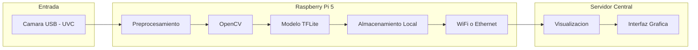

# Arquitectura
La arquitectura del sistema combina componentes de hardware y software para capturar, procesar, clasificar y visualizar las emociones de los espectadores en tiempo real. A continuación, se describe cómo cada función del sistema es ejecutada por un conjunto específico de componentes.

## Descripción General
El sistema está compuesto por los siguientes bloques funcionales:

### 1. Captura de Imágenes

**Función**: Obtener imágenes faciales del espectador.

**Hardware**: Cámara USB tipo UVC.

**Interfaz**: USB.

### 2. Procesamiento y Clasificación de Emociones (Edge AI)

**Función**: Preprocesar imágenes y detectar emociones.

**Hardware**: Raspberry Pi 5.

**Software**: OpenCV (preprocesamiento), TensorFlow Lite (clasificación).

**Interfaz**: Interna (entre módulos de software en la Raspberry Pi).

### 3. Almacenamiento Temporal

**Función**: Registrar resultados con marca de tiempo.

**Hardware**: Memoria local (SD o almacenamiento interno de la Raspberry Pi).

**Software**: Python (manejo de archivos o base de datos ligera como SQLite).

### 4. Comunicación y Transmisión de Resultados

**Función**: Enviar datos al servidor central.

**Hardware**: Módulo de red de la Raspberry Pi (Wi-Fi o Ethernet).

**Software**: Cliente HTTP, MQTT o WebSocket implementado en Python.

### 5. Visualización de Datos

**Función**: Mostrar los resultados de forma gráfica para su análisis.

**Hardware**: Servidor central (PC o nube).

**Software**: Dashboard en Grafana, Kibana o una aplicación web.

## Diagrama de Arquitectura del Sistema

