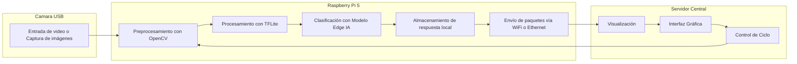

# Arquitectura
La arquitectura del sistema combina componentes de hardware y software para capturar, procesar, clasificar y visualizar las emociones de los espectadores en tiempo real. A continuación, se describe cómo cada función del sistema es ejecutada por un conjunto específico de componentes.

## Descripción General
El sistema está compuesto por los siguientes bloques funcionales:

### 1. Captura de Imágenes

- **Función**: Obtener imágenes faciales del espectador.

- **Hardware**: Cámara USB tipo UVC.

- **Interfaz**: USB.

### 2. Procesamiento y Clasificación de Emociones (Edge AI)

- **Función**: Preprocesar imágenes y detectar emociones.

- **Hardware**: Raspberry Pi 5.

- **Software**: OpenCV (preprocesamiento), TensorFlow Lite (procesamiento), Modelo (Edge AI).

- **Interfaz**: Interna (entre módulos de software en la Raspberry Pi).

### 3. Almacenamiento Temporal

- **Función**: Registrar resultados con marca de tiempo.

- **Hardware**: Memoria local (SD de almacenamiento interno de la Raspberry Pi).

- **Software**: Python (manejo de archivos).

### 4. Comunicación y Transmisión de Resultados

- **Función**: Enviar datos al servidor central.

- **Hardware**: Módulo de red de la Raspberry Pi (Wi-Fi o Ethernet).

- **Software**: Cliente HTTP, MQTT o WebSocket implementado en Python.

### 5. Visualización de Datos

- **Función**: Mostrar los resultados de forma gráfica para su análisis.

- **Hardware**: Servidor central (PC o nube).

- **Software**: Dashboard en Grafana, Kibana o una aplicación web.

## Diagrama de Arquitectura del Sistema

Descripción funcional del flujo del sistema
Recordando la vista funcional del sistema, este comienza con la Cámara USB, que se encarga de la captura de imágenes o video en tiempo real. Estas imágenes se envían directamente a la Raspberry Pi 5, que actúa como el núcleo de procesamiento local.

En la Raspberry Pi, las imágenes pasan primero por una etapa de preprocesamiento utilizando OpenCV, donde se realizan operaciones como redimensionamiento, conversión a escala de grises y limpieza de ruido para optimizar el análisis posterior. A continuación, las imágenes preprocesadas son procesadas mediante TensorFlow Lite, lo que permite ejecutar modelos de inteligencia artificial livianos directamente en el dispositivo.

Posteriormente, el sistema realiza la clasificación emocional utilizando un modelo de Edge AI, que detecta emociones como felicidad, tristeza, enojo, entre otras. Los resultados de esta inferencia se almacenan localmente junto con una marca temporal para futuras referencias o auditoría.

Luego, los datos son empaquetados y enviados vía Wi-Fi o Ethernet al Servidor Central, donde se realiza la visualización de los resultados. La información es desplegada en una interfaz gráfica amigable, permitiendo a los operadores monitorear en tiempo real o analizar datos históricos.

Finalmente, desde esta interfaz también se puede ejercer un control del ciclo del sistema, que puede ajustar parámetros o reiniciar el proceso. Esta orden de control se retroalimenta a la Raspberry Pi, reiniciando el flujo de procesamiento a partir del preprocesamiento.

