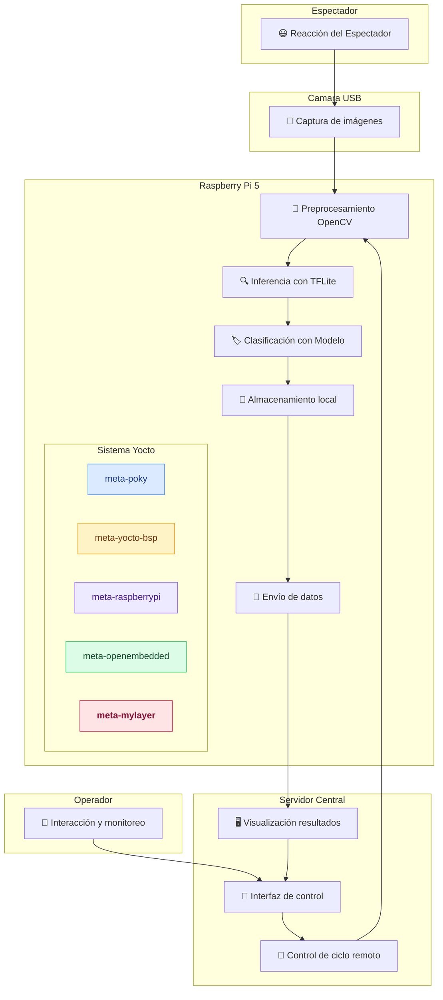

# Integración

El diagrama de la arquitectura integrada de software y hardware es: 

## 🧩 Descripción del proceso de integración hardware/software
La solución implementada combina de forma coordinada componentes de hardware y software para lograr un sistema funcional de detección y visualización de emociones. A continuación se detalla cómo se integran y complementan estos componentes en cada etapa del proceso:

- 😃 Reacción del Espectador: Es la reacción o la expresión de la emoción por parte del espectador

- 🟦 Cámara USB (hardware): Es el punto de entrada del sistema. Captura imágenes en tiempo real del espectador o usuario cuya expresión emocional será analizada.

- 🟩 Raspberry Pi 5 (hardware + software): Actúa como nodo de procesamiento en el borde. Recibe la imagen desde la cámara y ejecuta varios procesos:

  - OpenCV (software): Realiza el preprocesamiento de la imagen (detección de rostro, recorte, escalado y normalización).

  - TensorFlow Lite (software): Ejecuta el modelo de aprendizaje automático entrenado para clasificar emociones en tiempo real.

  - Red de comunicación (hardware/software): Se utiliza WiFi o Ethernet para transferir los resultados inferidos (emociones y timestamps) al servidor central.

- 🟥 Servidor o computador Central (hardware + software): Recibe los datos procesados desde la Raspberry Pi y permite la interacción con el operador:

  - Interfaz Gráfica (software): Presenta visualmente las emociones detectadas y permite al operador ajustar parámetros del sistema (por ejemplo, encender/apagar el ciclo de inferencia o cambiar umbrales de confianza).

  - Control remoto del ciclo de procesamiento (software): El operador puede modificar el comportamiento del sistema en tiempo real, enviando instrucciones de vuelta a la Raspberry Pi.

Este diseño modular e integrado permite una interacción fluida entre hardware y software: la Raspberry Pi se encarga de la inferencia local, optimizando la latencia y reduciendo la carga sobre la red, mientras que el servidor central actúa como centro de control y visualización, facilitando ajustes remotos y monitoreo continuo.
