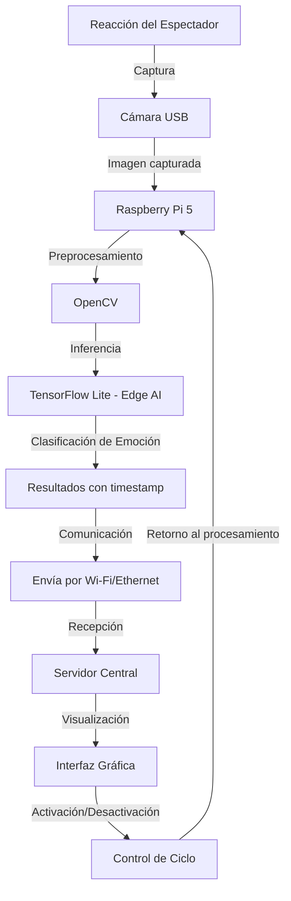

# Vista Funcional
En esta apartado se analizará la interacción de los componentes del sistema y sus funciones clave.

## 1. Entrada: Captura de Datos
**Función**: Capturar imágenes faciales de los espectadores.

**Dispositivo**: Cámara USB conectada a la Raspberry Pi.

**Descripción**: La cámara, instalada discretamente en los respaldos de los asientos, toma imágenes de los rostros en tiempo real, sin invadir la privacidad ni distraer al espectador.

## 2. Preprocesamiento de Imágenes
**Función**: Preparar las imágenes para la clasificación.

**Software**: OpenCV.

**Descripción**: Se aplican transformaciones como redimensionamiento, normalización y conversión a escala de grises. Esto optimiza el rendimiento del modelo y reduce la carga de procesamiento.

## 3. Clasificación de Emociones
**Función**: Detectar la emoción del espectador en cada imagen capturada.

**Modelo**: Modelo ligero de aprendizaje profundo entrenado con bases como FER2013, RAF-DB o CK+.

**Emociones clasificadas**: Enojo, disgusto, miedo, felicidad, tristeza y sorpresa.

**Descripción**: El modelo, ejecutado localmente mediante TensorFlow Lite, clasifica emociones en menos de 2 segundos por imagen, utilizando la capacidad de procesamiento de la Raspberry Pi (Edge AI), sin depender de la nube.

## 4. Almacenamiento y Registro Local
**Función**: Guardar temporalmente los resultados de la clasificación con marca de tiempo.

**Dispositivo**: Almacenamiento local en la Raspberry Pi.

**Descripción**: Los datos se almacenan como archivos estructurados o en una base de datos ligera para su posterior consulta y respaldo.

## 5. Envío de Resultados al Servidor
**Función**: Transmitir los resultados periódicamente a un servidor central o computador central.

**Protocolo**: HTTP, MQTT o WebSocket.

**Descripción**: Los datos son enviados por red local (Wi-Fi o Ethernet). Idealmente la transmisión debería ser eficiente y no interferir con el desempeño del sistema embebido.

## 6. Visualización e Interacción
**Función**: Mostrar los resultados en una interfaz gráfica accesible para el operador.

**Software**: Interfaz local personalizada.

**Descripción**: Los datos se presentan de forma visual, permitiendo un análisis en tiempo real o histórico del comportamiento emocional del público. Se puede incluir una función de activación/desactivación del sistema.

---

# Diagrama de Flujo de Reconocimiento y clasificacion de emociones

## 📘 Descripción funcional del flujo del sistema
El sistema comienza con la Cámara USB, que se encarga de la captura de imágenes o video en tiempo real. Estas imágenes se envían directamente a la Raspberry Pi 5, que actúa como el núcleo de procesamiento local.

En la Raspberry Pi, las imágenes pasan primero por una etapa de preprocesamiento utilizando OpenCV, donde se realizan operaciones como redimensionamiento, conversión a escala de grises y limpieza de ruido para optimizar el análisis posterior. A continuación, las imágenes preprocesadas son procesadas mediante TensorFlow Lite, lo que permite ejecutar modelos de inteligencia artificial livianos directamente en el dispositivo.

Posteriormente, el sistema realiza la clasificación emocional utilizando un modelo de Edge AI, que detecta emociones como felicidad, tristeza, enojo, entre otras. Los resultados de esta inferencia se almacenan localmente junto con una marca temporal para futuras referencias o auditoría.

Luego, los datos son empaquetados y enviados vía Wi-Fi o Ethernet al Servidor Central, donde se realiza la visualización de los resultados. La información es desplegada en una interfaz gráfica amigable, permitiendo a los operadores monitorear en tiempo real o analizar datos históricos.

Finalmente, desde esta interfaz también se puede ejercer un control del ciclo del sistema, que puede ajustar parámetros o reiniciar el proceso. Esta orden de control se retroalimenta a la Raspberry Pi, reiniciando el flujo de procesamiento a partir del preprocesamiento.
