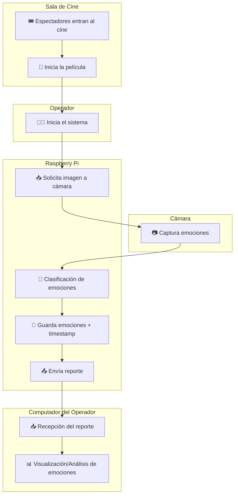
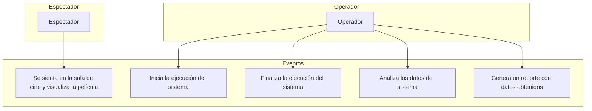

# Vista Operacional
A continuación, se muestra un diagrama de la vista operacional del sistema:

## 🧩 Descripción de la vista operacional
En este punto se presenta una descripción del comportamiento del sistema con el fin de que cualquier persona pueda entender su funcionamiento. Es importante que el modelo defina una perspectiva completamente operacional, sencilla y comprensible para el usuario. Por esta razón, se realiza una representación de alto nivel, en la cual se destacan los componentes principales del sistema y la manera en que se utilizan de forma secuencial para lograr la detección y registro de emociones. Esta representación permite visualizar el flujo de operación desde la llegada del espectador hasta la recopilación final de datos por parte del operador.

- 🎟️ Llegada del público: Los espectadores ingresan a la sala de cine y se acomodan en sus respectivas butacas para disfrutar de la película.

- 🧑‍💻 Operador: Cuando inicia la película, el operador activa el sistema de detección de emociones. Para ello, envía un comando a la Raspberry Pi a través de la red WiFi, ordenándole que encienda la cámara y comience el procesamiento.

- 🟦 Cámara USB: La camára se conecta a la Raspberry Pi, esta comienza a capturar imágenes de los rostros del público a razón de 1 fotograma por segundo (1 fps), y envía las capturas en tiempo real a la Pi.

- 🟩 Raspberry Pi 5: La raspberry recibe las imágenes capturadas por la cámara y la clasifica para determinar el estado emocional de la persona, por ultimo guarda la imagen mediante un archivo que contiene la emoción y el tiempo en que el rostro fue capturado.

- 🟥 Computador del Operador: Cuando termina la función o el operador decide finalizar el monitoreo, este envía otro comando a la Raspberry Pi para detener el sistema. Los archivos generados (emociones + timestamps) se transfieren automáticamente al computador del operador mediante protocolo SSH, aprovechando que ambos dispositivos están conectados a la misma red WiFi.

## 🎯 Diagrama de Casos de Uso
A partir de las funciones que desempeñan el espectador y el usuario, es posible construir el diagrama de casos de uso. El espectador simplemente se sienta y disfruta de la función de cine, mientras que el operador se encarga de varias funciones: iniciar y finalizar la ejecución de la aplicación, así como analizar los datos recolectados y generar reportes.

## 🕒 Diagrama de Secuencia

##Referencias
R. Kadakia, P. Kalkotwar, P. Jhaveri, R. Patanwadia and K. Srivastava, "Analysis of Micro Expressions using XAI," 2022 3rd International Conference on Computing, Analytics and Networks (ICAN), Rajpura, Punjab, India, 2022, pp. 1-7, doi: 10.1109/ICAN56228.2022.10007340.
