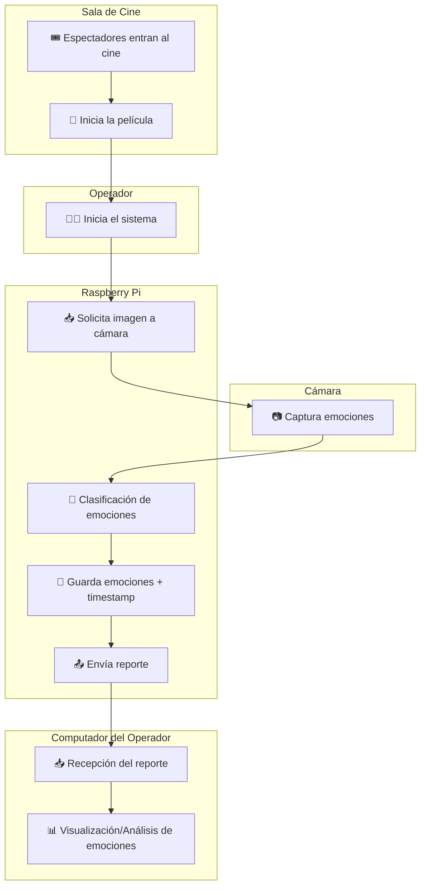

# Vista Operacional

```mermaid
flowchart TD
    subgraph Sala de Cine
        U1[🎟️ Espectadores entran al cine]
        U2[🎥 Inicia la película]
    end

    subgraph Operador
        O1[🧑‍💻 Inicia el sistema]
    end

    subgraph Cámara
        CAM1[📷 Captura emociones]
    end

    subgraph Raspberry Pi
        R2[📥 Solicita imagen a cámara]
        R3[🧠 Clasificación de emociones]
        R4[💾 Guarda emociones + timestamp]
        R5[📤 Envía reporte]
    end

    subgraph Computador del Operador
        CU1[📥 Recepción del reporte]
        CU2[📊 Visualización/Análisis de emociones]
    end

    U1 --> U2
    U2 --> O1
    O1 --> R2
    R2 --> CAM1
    CAM1 --> R3
    R3 --> R4
    R4 --> R5
    R5 --> CU1
    CU1 --> CU2

```
