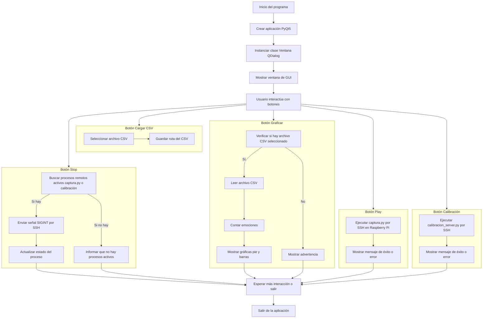

# Interfaz de Usuario

El diagrama de flujo de la interfaz se muestra en la siguiente Figura.

```mermaid

flowchart TD
 subgraph sub1["Botón Cargar CSV"]
        E1["Seleccionar archivo CSV"]
        F["Guardar ruta del CSV"]
  end
 subgraph sub2["Botón Graficar"]
        E2["Verificar si hay archivo CSV seleccionado"]
        G["Leer archivo CSV"]
        H["Contar emociones"]
        I["Mostrar gráficas pie y barras"]
        J["Mostrar advertencia"]
  end
 subgraph sub3["Botón Play"]
        E3["Ejecutar captura.py por SSH en Raspberry Pi"]
        K["Mostrar mensaje de éxito o error"]
  end
 subgraph sub4["Botón Calibración"]
        E4["Ejecutar calibracion_server.py por SSH"]
        L["Mostrar mensaje de éxito o error"]
  end
 subgraph sub5["Botón Stop"]
        E5["Buscar procesos remotos activos captura.py o calibración"]
        M["Enviar señal SIGINT por SSH"]
        N["Actualizar estado del proceso"]
        O["Informar que no hay procesos activos"]
  end
    A["Inicio del programa"] --> B["Crear aplicación PyQt5"]
    B --> C["Instanciar clase Ventana QDialog"]
    C --> D["Mostrar ventana de GUI"]
    D --> E["Usuario interactúa con botones"]
    E1 --> F
    E2 -- Sí --> G
    G --> H
    H --> I
    E2 -- No --> J
    E3 --> K
    E4 --> L
    E5 -- Si hay --> M
    M --> N
    E5 -- Si no hay --> O
    E --> sub1 & sub2 & sub3 & sub4 & sub5
    N --> P["Esperar más interacción o salir"]
    O --> P
    I --> P
    J --> P
    K --> P
    L --> P
    P --> Q["Salir de la aplicación"]
```
